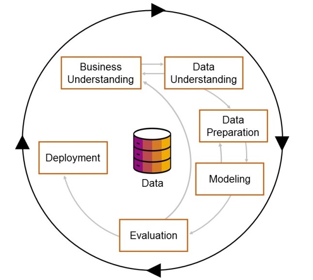
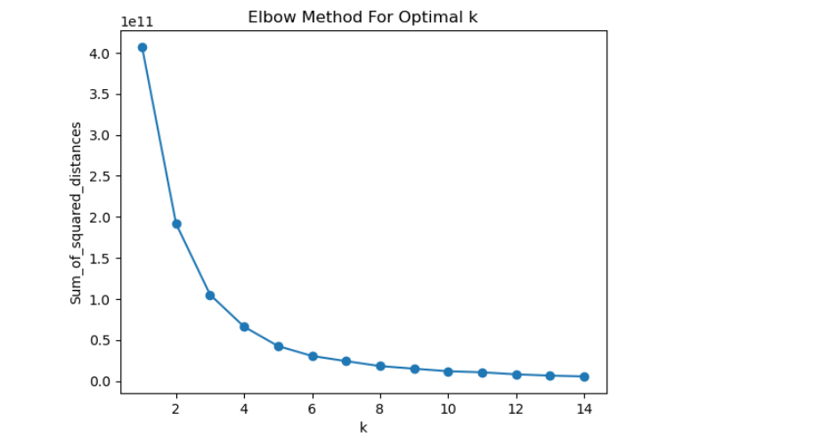
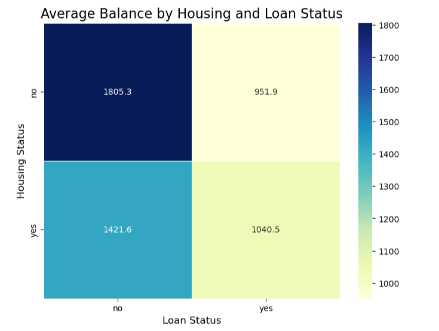

## Project Background

### Background:
IJJ Pte Ltd is a medium-sized bank headquartered in Singapore, serving a diverse clientele ranging from individual customers to small and medium enterprises (SMEs). As a growing financial institution, the bank aims to strengthen its market position by leveraging technology and data-driven strategies/insights. 

### Problem Statement
IJJ Pte Ltd struggles to attract high-value customers, optimize marketing efforts, and address customer complaints, impacting customer loyalty and business growth.

### Business Goal
To enhance customer retention, improve marketing strategies, and effectively resolve customer complaints for better satisfaction and brand loyalty.

### Objective 1 : Attract New and Retain Existing High-Value Customers (LO HUNG-YIN)
Enhance customer targeting with data-driven insights to match high-value customers with relevant financial products, boosting marketing effectiveness, satisfaction, and growth.
### Objective 2 : Enhance Marketing Performance (Joycelyn)
Implement proven marketing strategies to improve customer engagement (measured by whether a customer has signed up for term deposit in this case).
### Objective 3 : Analyze customer feedback related to product and services. (Ivy)
Leverage bank review analysis to identify opportunities for enhancing IJJ's product and service offerings, ultimately improving customer experience and driving business growth.

## Work Accomplished
### Outcomes  

The outcomes comprise two parts:  

#### **Part 1: Identifying Existing High-Value Customers**  
The goal is to identify high-value customers and provide them with premium services to enhance retention.  

1) Use the **K-means+ Pipeline-Based Approach Model** to identify **Cluster 2**, which represents high-value customers.  
2) Use the **Standard K-means clustering model** to segment customers into four clusters (optimal K value). This approach successfully identifies **Cluster 2** as well.  
3) In the **deployment stage**, after approval, the refined dataset of high-value customers will be handed over to the marketing team for integration into the bank’s marketing strategy.  

#### **Part 2: Identifying Potential Customers**  
The goal is to attract potential customers to purchase relevant products beyond savings, encouraging them to become high-value customers and invest in new banking products.  

1) Utilize a **heat map matrix** to categorize customers into **four quadrants**, allowing for targeted product recommendations based on age groups. This strategy was ideated by bank staff with strong domain knowledge.  
2) Overall, through the application of **statistical analysis tools and machine learning models**, the project successfully supports management in implementing **differentiated marketing strategies**. These strategies help target diverse customer segments according to their preferences while staying within budget constraints.

### Data Preparation

### Steps for Data Preparation
 **1) Data Collection:** Gather the necessary data by exploring different sources, e.g., Kaggle.

 **2) Data Cleaning:** Identify and correct errors, remove duplicates, handle missing values (e.g., check if there are null cells in any of the columns using incomes_mod.isnull().any()), and correct inconsistencies.

 **3) Data Integration:** Combine data from different sources. This step often involves merging tables into a unified dataset (e.g., joining tables).

 **4) Data Transformation:** Convert data into a suitable format for analysis. This may include normalization, standardization (e.g., standardizing text values by stripping spaces and converting to lowercase), encoding categorical variables to numerical (e.g., marketing_data = marketing_data.apply(pd.to_numeric, errors='coerce').astype('Int64')), and creating new derived variables (e.g., profit = revenue - cost).

 **5) Data Exploration:** Conduct preliminary analysis to understand the characteristics of the data. This can include visualizations, summary statistics, and identifying patterns or anomalies (e.g., creating histograms to visualize demographics versus bank balance to see how different clusters of customers behave differently).

 **6) Documentation:** Document all steps taken in the data preparation process for reproducibility and to ensure clarity in the methodology.

### Modelling
**Model 1** - Pipeline-Based Approach Model or K-means++:
- Unsupervised, unlabelled machine learning algorithm
- Clustering data into K groups, clusters based on the features similarity
- Each data point belongs to the particular cluster with the nearest mean

A Pipeline helps automate preprocessing steps before applying KMeans. A ColumnTransformer is used to apply different preprocessing techniques to different columns (e.g., scaling numerical features and encoding categorical ones).
**Select relevant numerical features**
numerical_features = ['balance','age_group_num']

**Select categorical features**
categorical_features = ['job', 'marital', 'education', 'housing']

with help of **'Elbow Method for Optimal K'** to find the number of cluster most optimal
with 80% training sample, 20% validation sample
create scatterplot to bubbles of different size.

once confirmed the cluster 2 is the **high-value customers**, Filter and display all customers belonging to Cluster 2
cluster_2_customers = marketing_data[marketing_data['cluster'] == 2] 
 

**Model 2** - The standard K-means:
 **1) Convert all numeric-looking columns to int64**
 **2) Verify the conversion**
 **3) Standardize text values: strip spaces and convert to lowercase**
 **4) Map values again and replace NaN with 0**
 **5) Verify the changes**
 **6) Selected features to explore**
 **7) try arbitrarily 3 clusters**
 **8) Principal Component Analysis for Visualization**
 **9) Plot the scatter plot**

### Evaluation

**1) Goal:** model performance align with business goals, explore the high-value customers group
 **2) Technical Evaluation:**
Use metrics like accuracy, precision, recall, F1-score, ROC-AUC, or RMSE.
Validate models on holdout test data or via cross-validation.
Compare multiple models (e.g., A/B testing).
 **3) Business Evaluation:**
Assess ROI, feasibility, and ethical implications (e.g., bias, fairness).
 **4) Output:**
Performance reports (e.g.Silhouette Coefficient, a higher Silhouette Score means: Clusters are well-separated ).
Decision-making for deployment-management decides

### Recommendation and Analysis
**Conclusion:** 
We propose a **Differentiated Marketing Strategy** for IJJ Bank to target multiple market segments with tailored products and strategies. Customers will be grouped into clusters based on their demographic characteristics, and marketing campaigns will be scheduled accordingly to promote relevant products.
After implementing the stage 1 deployment, evaluating the outcomes in terms of the performance of the marketing campaigns and the informations of the products buying. The collected data will be the datum line for the stage 2 targeting strategy, to fine tuning the features, i.e. the job, education among the age groups. 
**Recommendation:** 
**1) to achieve the retain and enhance the services to high-value custormers in saving accounts** - target the cluster 2 customers 
**2) to attract the new customers from within the banks or external customers:** 
a. to target customers without housing loan or bank loan the moderate risk products, visa cards, etc.
b. to target the customers of old ages with low risk products, e.g. the bonds or time deposit.

## AI Ethics
Discuss the potential data science ethics issues (privacy, fairness, accuracy, accountability, transparency) in your project. 
**1. Privacy**:  
Collecting transaction histories in bank, risks in violating privacy laws like PDPA/GDPR if not anonymized or consented (signed with consent forms). 
**2. Fairness**:  
Bias may arise if models overrepresent affluent demographics. Historical data might undervalue younger customers. 
**3. Accuracy**:  
Datasets are not comprehensive (e.g. only bank saving balance info, no time deposit or other investment records), Incomplete data (e.g., missing transactions) or mislabeling customers as “low-value” due to temporary setbacks (e.g., medical bills) reduces reliability. 
**4. Accountability**:  
Unclear ownership of errors, who are to be accountable and lack of monitoring for performance and conduct. Establish governance frameworks (e.g., an ethics committee)is neccesary.
**5. Transparency:**
Black-box models (e.g., neural networks) hinder explainability, use interpretable models to facilitate the communication of policies plainly and enable feedback channels.  

## Source Codes and Datasets
Upload your model files and dataset into a GitHub repo and add the link here. 
https://github.com/alum05-lhy0001/itd214_proj
